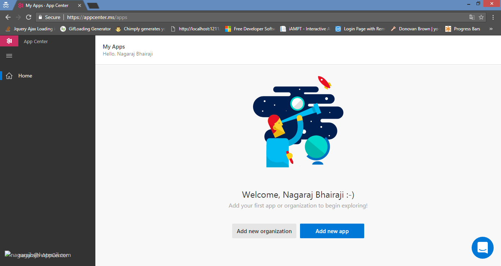
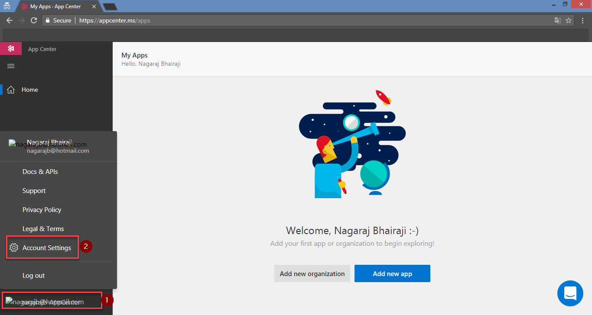
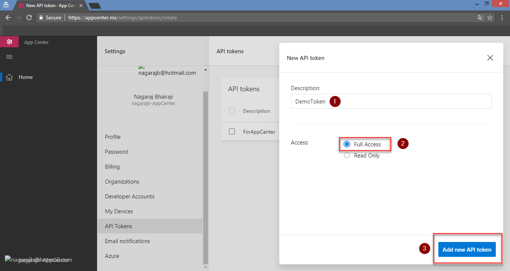
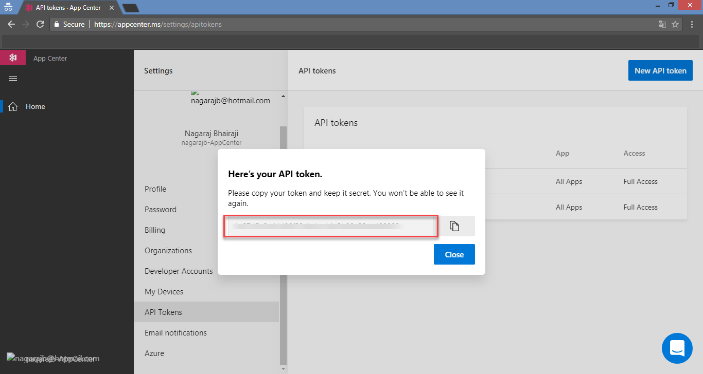

# Generating API Token for App Center

## 1. Login to [AppCenter](https://appcenter.ms/) portal:

## 2. Click on **settings** and select **Account Settings**

## 3. Click in **API Tokens** and then select **New API Token**:

## 4. Provide a **Description** for Token and select **Full Access** under Access and click on **Add New API Token**:

## 5. **Copy** Generated API Token

