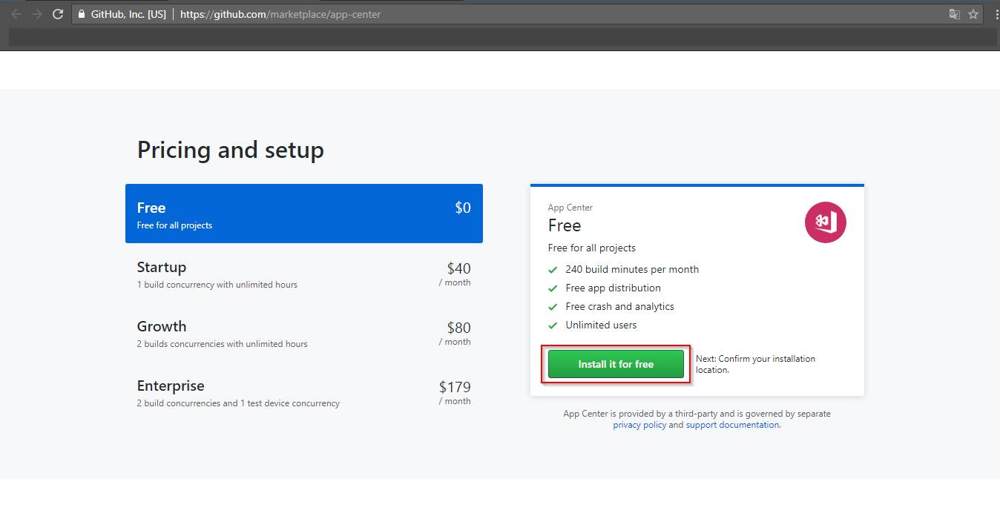
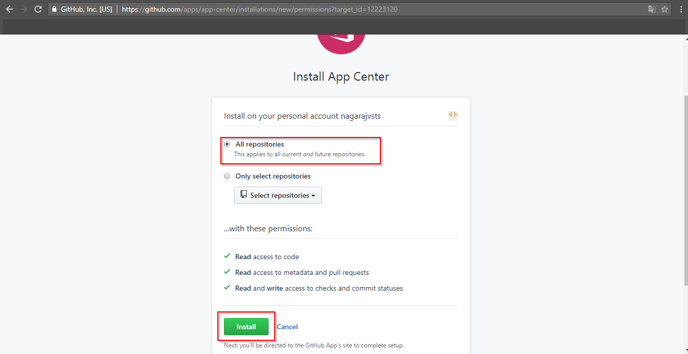
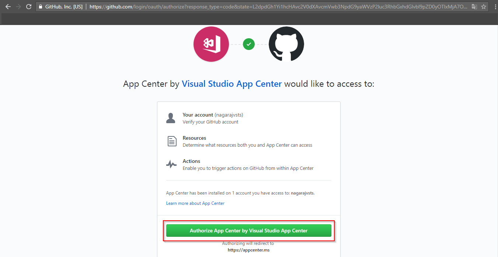

# Installing AppCenter app from GitHub marketplace to GitHub

## 1. Go to [GitHub marketplace](https://github.com/marketplace/) and find [AppCenter](https://github.com/marketplace/app-center) app:

## 2. Select **Free** plan under Pricing and setup, click on **install it for free**:

## 3. Under Review your order section, click on **Complete Order and begin installation**:

## 4. Select **All repositories** and click on **install**:

## 5. Click on **Authorize App Center by Visual Studio App Center**:

