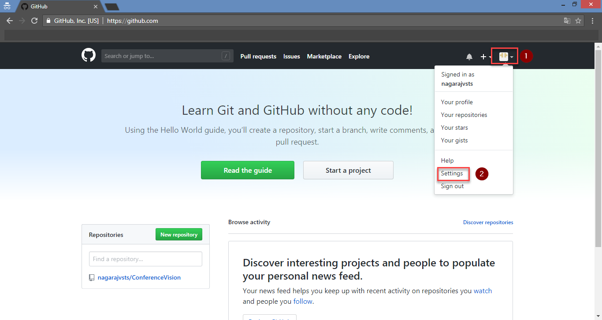
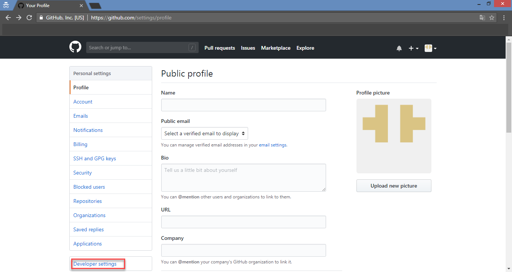
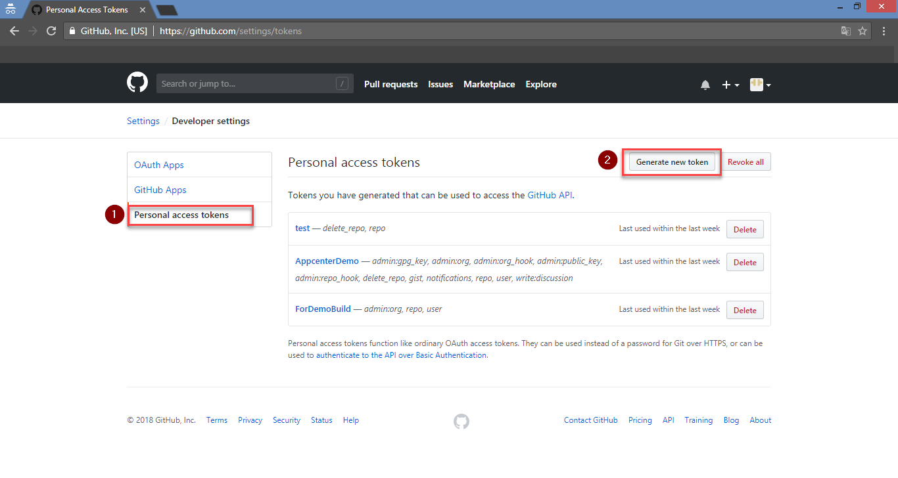
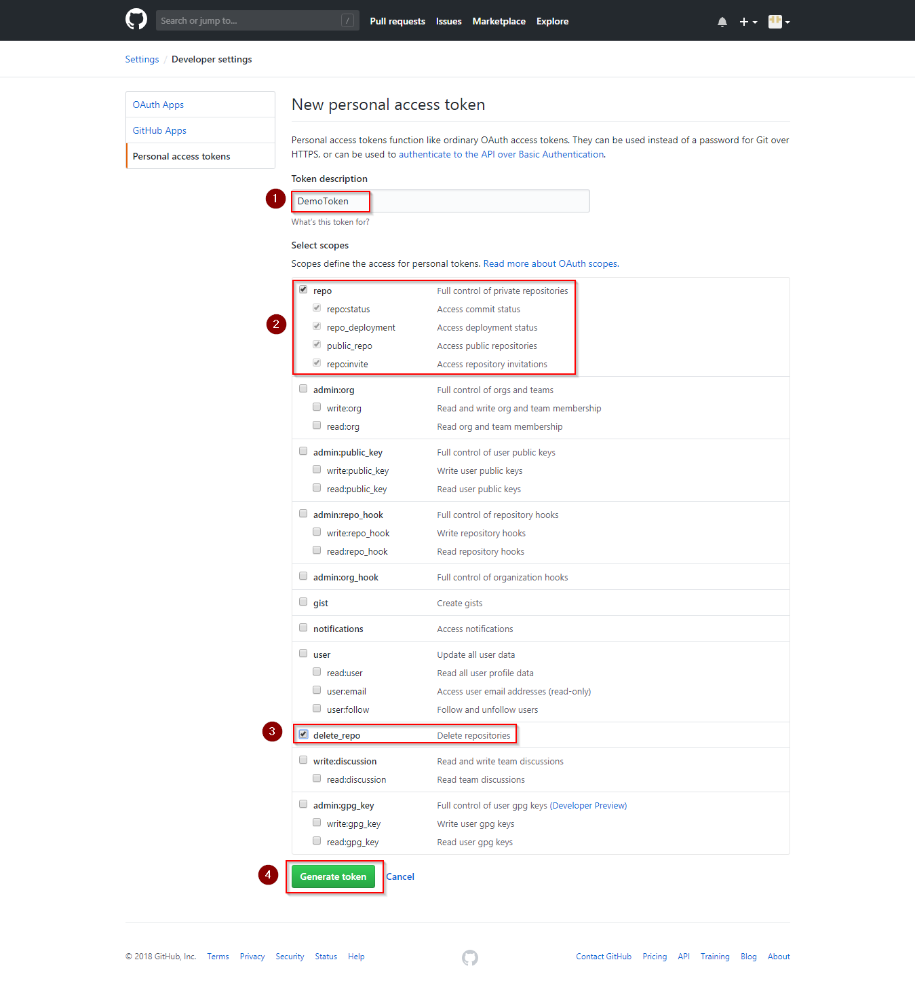
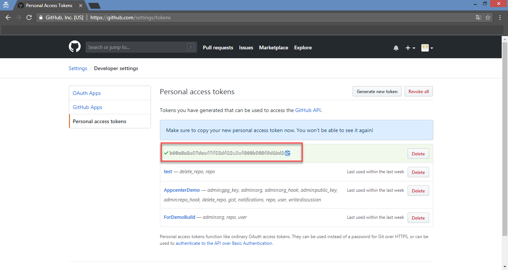

# Generate Personal Access Token (PAT) for GitHub

## 1. Login to [GitHub](https://github.com), click on profile icon and then select settings:

## 2.Click on **Developer settings**:

## 3.Click on Personal Access Tokens and select **Generate New Token**:

## 4. Provide a description and select **repo** and **delete_repo**  scopes, click on Generate token:

## 5. **Copy** the generated Personal Acces Token:

